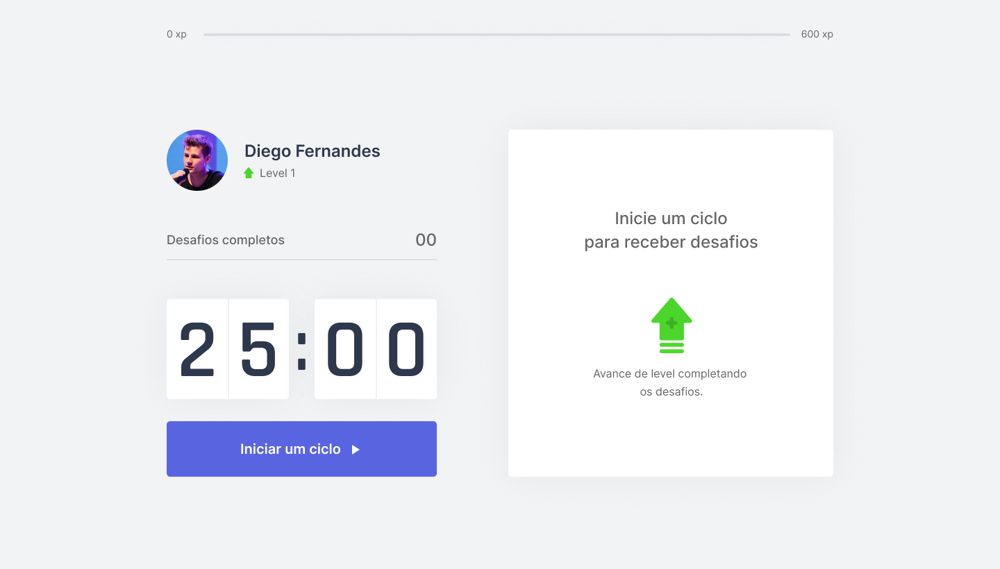
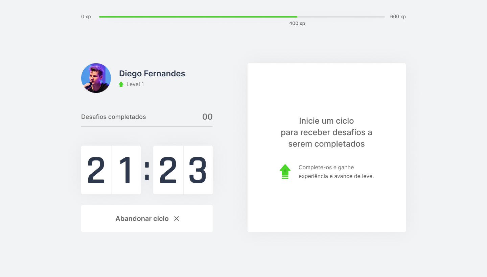
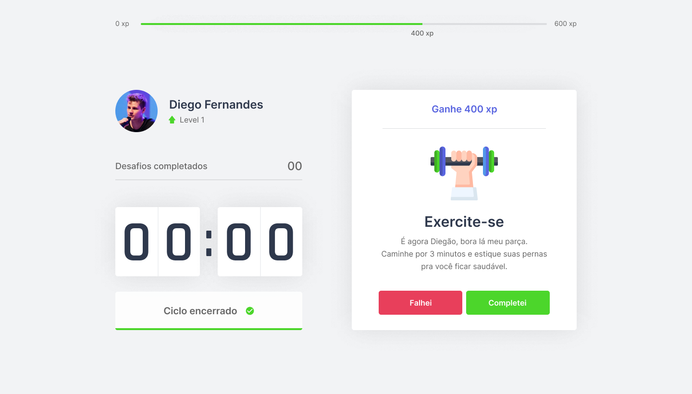
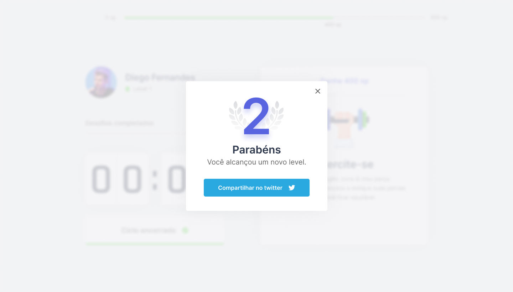

<h2 align="center">
  
  
  
  
  
</h2>


<p align="center">
   
</p>

#### ⚠️ Esta aplicação se encontra em desenvolvimento!⚠️
##### Tendo como base neste cronograma. 
| Dia, etapa   | Assunto |
|----------|----------|
|Segunda | Introdução ✅| 
|Terça [Hoje] |  Desvendando o Next.js ✅|
|Quarta |  Contexto e componentes |
|Quinta |  Storage, SRR & Lambda |
|Sexta |  Próximo nivel com React |

Toda descrição abaixo esta referida a etapa atual.
## 📖 Sobre 


Aplicação voltada ao publico estudande, dispondo de uma solução para estudos duradoutos sem problemas comuns como dores, sedentarismo uso continuo da visão e etc. 

O projeto está sendo desenvolvido durante o evento de programação Next Level Week sendo elaborado pela Instituição educacional [Rocketseat](https://github.com/Rocketseat).


<div align="center">
   <sub>Desenvolvido por 
    <a href="https://github.com/ArthurHMES">Arthur Eller</a>, sobre o auxílio do instrutor 
    <a href="https://github.com/diego3g">Diego Fernandes.</a>
  </sub>
</div>

## :pushpin: Tabela de Conteúdo

* [Tecnologias](#computer-tecnologias)
* [Funcionalidades](#rocket-funcionalidades)
* [Rodando projeto na sua máquina](#construction_worker-como-rodar)

* [Licença](#memo-licença)

### Layout
Este projeto ainda não foi concluido mas este é o layout base para contrução da aplicação

|  |  |
|----------|----------|
|  |   |
|  |   |


Você tambem pode copiar e editar esse layout: [Figma](https://www.figma.com/file/ge20pu3ofMOKoliUyKx1Nl/Move.it-1.0/duplicate)
## :computer: Tecnologias
Até o momento esse projeto foi feito utilizando as seguintes tecnologias:

* [Typescript](https://www.typescriptlang.org/)
* [React](https://reactjs.org/)
* [Next JS](https://nextjs.org/)

## :rocket: Funcionalidades
Essas funcionalidades contemplam o projeto.

* Integração de metodo pomodoro.
* Gamificação.

# :construction_worker: Como rodar

```bash
# Clone o Repositorio
$ git clone https://github.com/arthurhmes/Move.it.git

```
### 💻 Inicializando o projeto!

```bash
# Instale as depedencias
$ yarn install

# Rode a aplicação
$ yarn start

```
Acesse: http://localhost:3000/ para ver o resultado.

### 🌐 Netlify
!! Breve

# :memo: Licença

Lançado em 2021 :memo: Licença
Esse projeto esta sobre [MIT license](./LICENSE).


<h4 align="center">
    Feito com 💜 by <a href="https://www.linkedin.com/in/arthur-eller/" target="_blank">Arthur Eller </a>
</h4>
